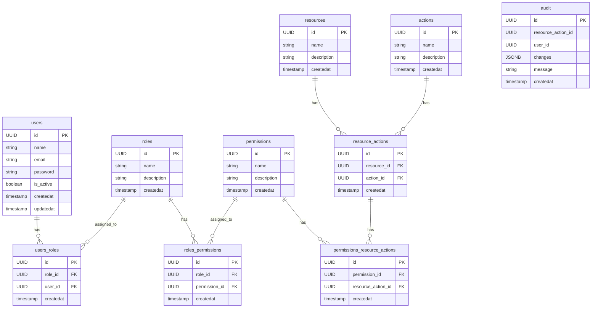

# Berry

# RBAC System

A Role-Based Access Control (RBAC) system that manages user roles and permissions to secure resources and streamline access control within an application.

## Features:

- [x] **User Authentication**: Basic user login system with secure authentication.
- [ ] **Roles & Permissions**: Define roles (e.g., Admin, User, Manager) and assign permissions (e.g., create, read, update, delete).
- [ ] **Dynamic Role Assignment**: Assign roles to users dynamically, with the ability to change roles as needed.
- [ ] **Resource Enrollment**: Register resources (e.g., API endpoints, database tables) within the system and manage their access controls.

- [ ] **Role Hierarchy**: Support for role inheritance (e.g., Admin > Manager > User) to simplify permission management.
- [ ] **Permission Validation**: Check user permissions dynamically for each resource or action based on assigned roles.
- [ ] **User Groups**: Group users with common roles or permissions for simplified management.
- [ ] **Access Control Lists (ACLs)**: Define access control lists to specify what resources can be accessed by which users or roles.
- [ ] **Audit Logs**: Track role assignments, permission changes, and resource access for security and accountability.
- [ ] **Token Based Access Control**: Use JWT or other token mechanisms to validate user permissions in the authentication flow.
- [ ] **Resource Based Policies**: Create policies that govern access to specific resources or actions, beyond just roles.

# ER Diagram

